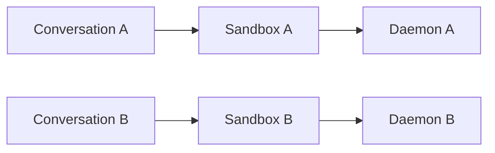
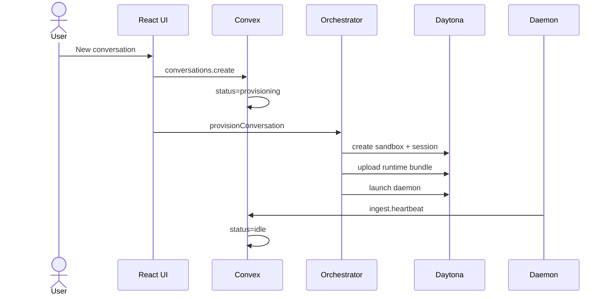
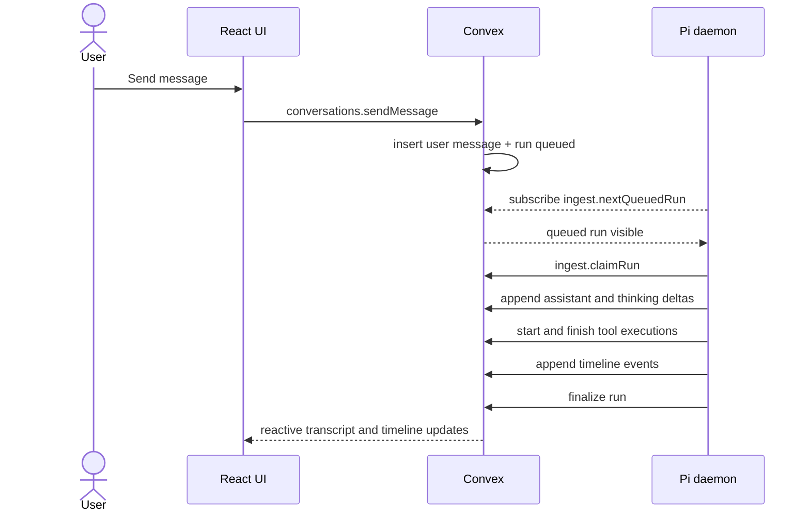
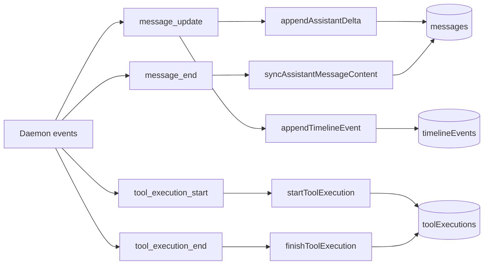
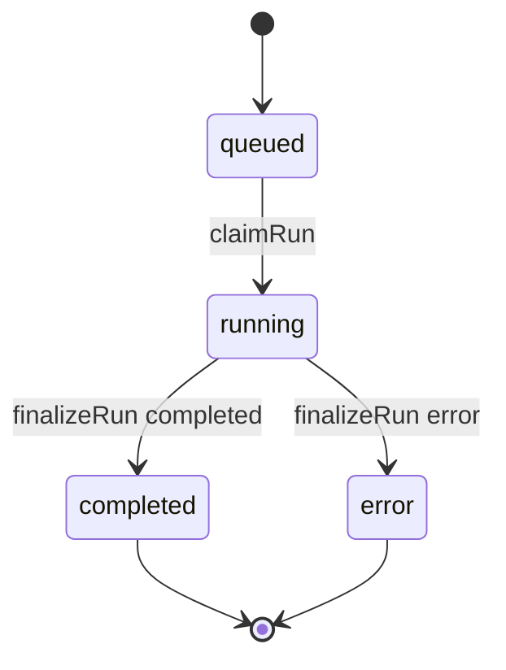

# Smart Pi Assistant

Minimal systems-design implementation of an agentic chatbot using TypeScript, Convex, Daytona, and Pi Agent.

The project is intentionally designed for the assignment goal: architecture clarity and execution-plane isolation over feature breadth.

## Demo

- YouTube: https://youtu.be/4lPLKUCL4Qw

## Assignment Fit (At a Glance)

- One conversation/thread maps to one dedicated Daytona sandbox/session.
- Pi Agent runs inside Daytona (not inside UI/backend process).
- Clear control plane vs execution plane separation.
- Progressive streaming for assistant text and thinking deltas.
- Full observability: message history, tool history, ordered timeline, raw events.

## Requirement Mapping

| Assignment requirement | Status | Where implemented |
| --- | --- | --- |
| Basic chat UI (new thread, send/receive) | Implemented | `src/components/conversation/*`, `src/components/chat/*`, `src/App.tsx` |
| Progressive streaming responses | Implemented | `agent/src/runLoop.ts`, `convex/ingest.ts`, `src/components/chat/MessageBubble.tsx` |
| New conversation creates dedicated Daytona session | Implemented | `convex/orchestrator.ts`, `convex/conversations.ts` |
| Pi Agent runs inside Daytona (not control plane) | Implemented | `agent/src/agentHost.ts`, `scripts/bundle-runtime.mjs`, `convex/orchestrator.ts` |
| Control plane vs execution plane separation | Implemented | Control: `src/*` + `convex/*`; Execution: `agent/src/*` |
| Required tools: `bash`, `read`, `write`, `edit`, `grep`, `glob`, `webfetch`, `websearch` | Implemented | `agent/src/tools/*.ts`, registered in `agent/src/tools/index.ts` |
| Structured tool outputs + streaming where feasible | Implemented | `agent/src/tools/*` output schema + `toolExecutions` + live bash chunks |
| Convex backend for state, API, and session mapping | Implemented | `convex/schema.ts`, `convex/conversations.ts`, `convex/ingest.ts`, `convex/orchestrator.ts` |
| Observability (messages + tool order/history) | Implemented | `messages`, `toolExecutions`, `timelineEvents`, UI observability panel |

## Architecture

The system has three clear zones:

- Control plane: React UI + Convex (state, orchestration, observability storage).
- Bridge layer: Orchestrator actions that provision/revive/delete Daytona sandboxes.
- Execution plane: one in-VM long-lived Pi daemon per conversation.

### Design Goals

- Strong isolation: each conversation has its own VM, session, workspace, and daemon.
- Honest separation: backend orchestrates, VM executes.
- Reactive UX: assistant/tool events stream and render without polling.
- Mechanical observability: each meaningful run step is persisted.
- Graceful recovery: stale daemons and broken runs can be revived/finalized.

### Component Responsibilities

| Layer | Lives where | Owns | Never does |
| --- | --- | --- | --- |
| React UI | Browser | Chat UX, conversation switching, observability rendering | Executes shell/tools directly |
| Convex queries/mutations | Control plane | Durable transcript, run queue, tool logs, timeline | Runs model-generated shell commands |
| Convex Node actions | Control plane | Sandbox lifecycle, daemon bootstrap/revival/teardown | Hosts agent execution loop |
| Daytona sandbox | Execution plane | Isolated compute, filesystem, process runtime | Source-of-truth conversation storage |
| Pi daemon | Execution plane | Run pickup, model prompts, tool calls, event emission | Provisions infrastructure |

### System Shape

```mermaid
flowchart TB
  USER[User] --> UI[React UI]

  subgraph CONTROL[Control Plane]
    UI --> CONVEX[Convex queries and mutations]
    CONVEX --> DB[(Convex DB)]
    CONVEX --> ORCH[Orchestrator actions]
    ORCH --> SWEEP[Crons and sweeper]
  end

  subgraph EXEC[Execution Plane]
    ORCH --> VM[Daytona sandbox]
    VM --> SESSION[Persistent Daytona session]
    SESSION --> DAEMON[Pi daemon]
    DAEMON --> TOOLS[bash read write edit grep glob webfetch websearch share_file]
    TOOLS --> WORKSPACE[/home/daytona/workspace]
    DAEMON --> MODEL[Model providers via pi-ai]
  end

  DAEMON -->|heartbeat runs tools timeline| CONVEX
  DB -->|reactive updates| UI
```

### Thread-to-VM Mapping

Core invariant: one thread, one sandbox, one daemon.



Benefits:

- No cross-thread filesystem mixing.
- No shared shell process across conversations.
- Clear ownership of tool history and VM state.

## Lifecycle Choreography

### Provision Flow



### Run Flow



## Agent Tools

Required tools are all implemented:

- `bash`
- `read`
- `write`
- `edit`
- `grep`
- `glob`
- `webfetch`
- `websearch`

Additional helper:

- `share_file` for exporting sandbox files to downloadable artifacts.

Tool behavior:

- Structured outputs persisted in `toolExecutions`.
- Tool execution order persisted by `sequence` and `timelineEvents`.
- Bash chunks stream incrementally.
- Default timeout is 5 seconds per tool call (override with `timeoutSeconds`).

## Observability Design

Two-layer observability model:

- `timelineEvents`: ordered raw runtime stream.
- `toolExecutions`: normalized tool audit rows for cards/tables.



Primary observability UI:

- `src/components/observability/TimelineView.tsx`
- `src/components/observability/ToolHistoryTable.tsx`
- `src/components/observability/RawEventsDrawer.tsx`
- `src/components/chat/MessageBubble.tsx`

## Run State Model



## Data Model

Core Convex tables:

- `conversations`: thread metadata, sandbox mapping, heartbeat, runtime version, status.
- `messages`: ordered transcript with streaming assistant and optional thinking content.
- `runs`: queued/running/completed/error execution unit per user turn.
- `toolExecutions`: per-tool call logs (input, output/error, timing, status).
- `timelineEvents`: ordered event stream for observability and phase rendering.
- `sessionFiles`: upload/download lifecycle for file transfer.

See `convex/schema.ts`.

## Reliability, Consistency, Security

### Reliability

- Daemon heartbeat is tracked and used for revive logic.
- `reviveDaemonIfDead` restarts stale or mismatched runtime daemons.
- Cancel/finalize paths close running tool records defensively.
- New user message supersedes prior in-flight runs for responsiveness.

### Consistency

- Runs are claimed atomically before execution.
- Assistant message is ensured before delta streaming.
- Final assistant content is synced before run completion.
- Conversation returns to `idle` after run finalization.

### Security and Isolation

- Untrusted tool execution stays inside Daytona sandbox.
- VM writes are token-gated (`agentToken`, `runToken`).
- Workspace path guards keep file operations in sandbox root.
- One sandbox per conversation forms the isolation boundary.

## Repository Layout

```text
AgenticAI-Assignment/
  agent/
    src/
      agentHost.ts
      runLoop.ts
      agentSession.ts
      convexBridge.ts
      convexApi.ts
      deltaBuffer.ts
      workspace.ts
      systemPrompt.ts
      tools/
  convex/
    schema.ts
    conversations.ts
    ingest.ts
    orchestrator.ts
    sweeper.ts
    sweeperData.ts
    crons.ts
    runtime/
      agentHostBundle.generated.ts
  scripts/
    bundle-runtime.mjs
  src/
    App.tsx
    components/
    hooks/
    lib/
    styles/
```

## Setup

### Prerequisites

- Node.js 20+
- Convex account
- Daytona API key
- OpenAI API key
- Gemini API key (kept for compatibility)
- Tavily API key (recommended for better websearch)

### Install

```bash
npm install
```

### Configure Convex

```bash
npx convex dev
```

### Set Convex deployment secrets

```bash
npx convex env set DAYTONA_API_KEY "dtn_..."
npx convex env set OPENAI_API_KEY "sk-..."
npx convex env set GEMINI_API_KEY "AIza..."
npx convex env set TAVILY_API_KEY "tvly-..."
npx convex env set ANTHROPIC_API_KEY "sk-ant-..."      # optional
npx convex env set DAYTONA_SNAPSHOT "agentic-runtime"  # optional
```

### Build and typecheck

```bash
npm run bundle:agent
npm run check
```

### Start development

```bash
npm run dev
```

Open: `http://localhost:5173`

## Environment Variables

### Local client and dev CLI

- `CONVEX_DEPLOYMENT`
- `VITE_CONVEX_URL`
- `VITE_CONVEX_SITE_URL` (optional for sharing links)

### Convex deployment secrets

- `DAYTONA_API_KEY`
- `OPENAI_API_KEY`
- `GEMINI_API_KEY`
- `TAVILY_API_KEY` (optional)
- `ANTHROPIC_API_KEY` (optional)
- `DAYTONA_SNAPSHOT` (optional)

### Runtime env injected into sandbox daemon

- `CONVEX_URL`
- `CONVEX_CONVERSATION_ID`
- `CONVEX_AGENT_TOKEN`
- `OPENAI_API_KEY`
- `GEMINI_API_KEY` (for compatibility)
- `TAVILY_API_KEY`
- `ANTHROPIC_API_KEY` (if set)
- `AGENT_WORKSPACE_DIR`
- `AGENT_MODEL_ID`
- `AGENT_THINKING_LEVEL`

## File Transfer Lifecycle

1. User upload:
   - browser uploads to Convex storage via signed URL
   - worker copies file into sandbox workspace uploads directory
2. Agent export:
   - agent calls `share_file`
   - worker downloads from sandbox and stores in Convex
   - UI renders downloadable artifact
3. Session history:
   - all transfers tracked in `sessionFiles` with status transitions and metadata

Current transfer size policy: 25 MB max for upload/export workers.

## Design Tradeoffs

1. One sandbox per conversation
   - Pro: strongest isolation and simplest mapping model.
   - Con: higher infra cost than pooled executors.
2. Long-lived daemon per conversation
   - Pro: better latency and smoother streaming.
   - Con: requires heartbeat/revive lifecycle management.
3. Dual observability tables
   - Pro: both forensic timeline and UI-friendly tool history.
   - Con: more backend plumbing than a single log stream.
4. Bundled runtime delivered via Convex
   - Pro: deterministic runtime versioning.
   - Con: requires bundle refresh after runtime code updates.

## Useful Commands

```bash
npm run dev
npm run bundle:agent
npm run check
npx convex dev --once
npx convex dev
```