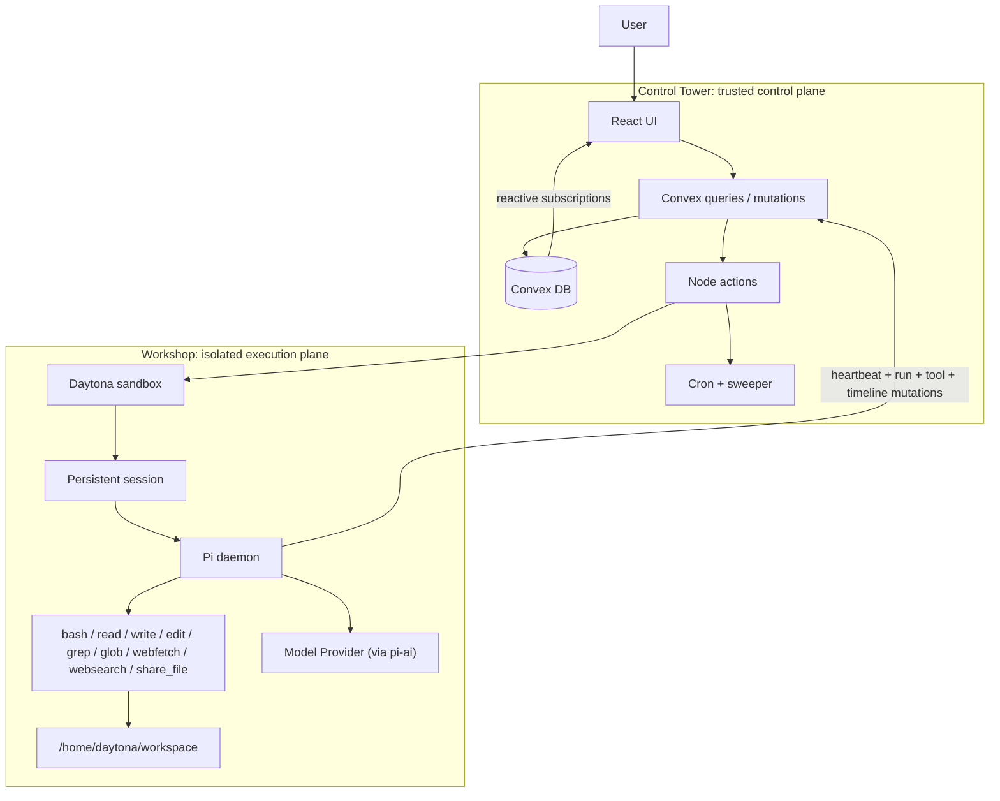
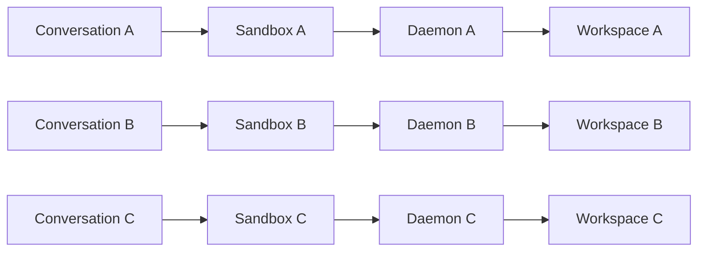
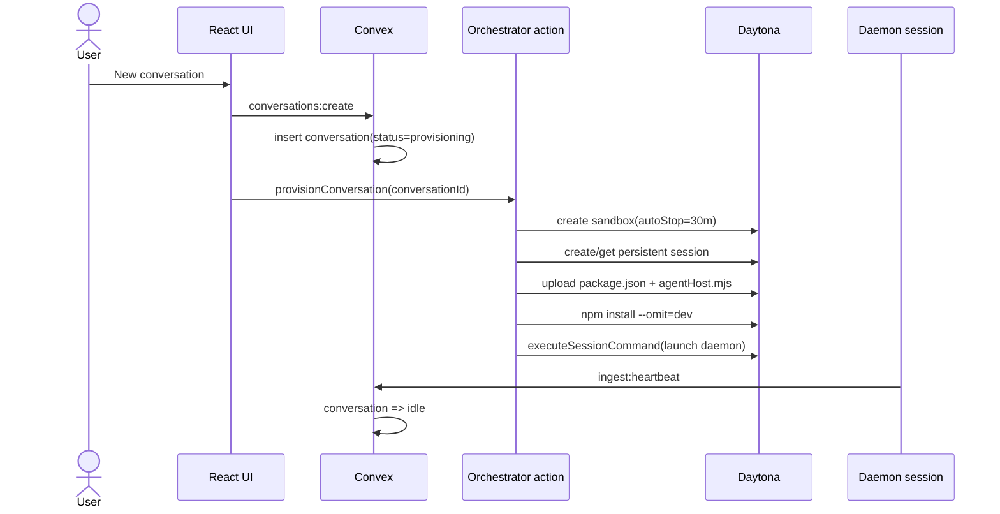
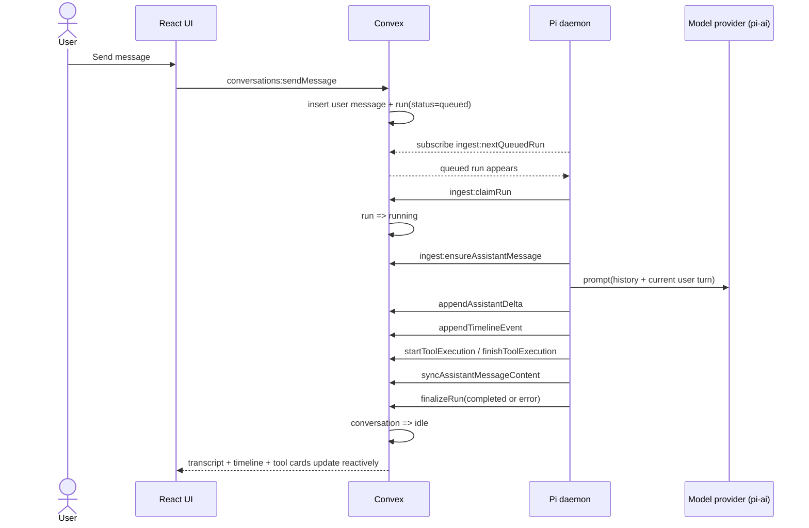
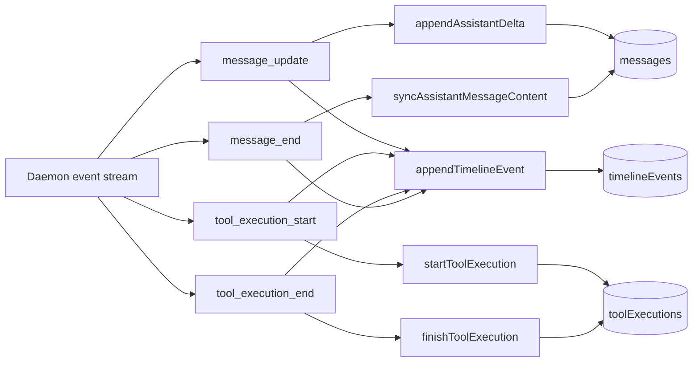
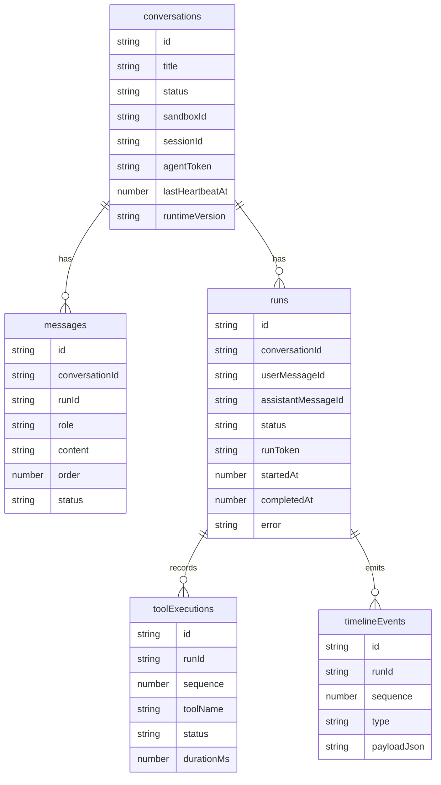

# Smart Pi Assistant

This project implements an agentic chat system with a strict control-plane / execution-plane split:

- Control plane: React UI + Convex state and orchestration.
- Execution plane: one isolated Daytona sandbox per conversation.
- Agent runtime: long-lived Pi daemon inside each sandbox, powered by `pi-agent-core` + `pi-ai` model adapters.
- Conversation-scoped file lifecycle: user upload to sandbox, agent-exported downloadable artifacts, and full file history.

The goal is to satisfy the assignment requirement that the agent executes inside an isolated VM while preserving good observability (timeline, tool history, run state, and raw events).

## Assignment Requirement Mapping

| Assignment requirement | Status | Where implemented |
| --- | --- | --- |
| Basic chat UI (new thread, send/receive) | Implemented | `src/components/conversation/*`, `src/components/chat/*`, `src/App.tsx` |
| Progressive streaming responses | Implemented | `agent/src/runLoop.ts` (`appendAssistantDelta`), `convex/ingest.ts`, `src/components/chat/MessageBubble.tsx` |
| One Daytona VM/session per conversation | Implemented | `convex/orchestrator.ts`, `convex/conversations.ts` |
| Pi Agent runs inside Daytona (not control plane) | Implemented | `agent/src/agentHost.ts`, `scripts/bundle-runtime.mjs`, `convex/orchestrator.ts` |
| Control plane vs execution plane separation | Implemented | Control: React + Convex (`src/*`, `convex/*.ts`), Execution: daemon + tools (`agent/src/*`) |
| Required tools: `bash`, `read`, `write`, `edit`, `grep`, `glob`, `webfetch`, `websearch` | Implemented | `agent/src/tools/*.ts`, registered in `agent/src/tools/index.ts` |
| Structured tool outputs + streaming where feasible | Implemented | tool `content + details` pattern in `agent/src/tools/*`; live shell chunk streaming via `appendToolOutput` |
| Convex backend for DB/API/state/session mapping | Implemented | `convex/schema.ts`, `convex/conversations.ts`, `convex/ingest.ts`, `convex/orchestrator.ts` |
| Observability: messages + tool history + execution order | Implemented | `messages`, `toolExecutions`, `timelineEvents`; UI in `MessageBubble`, `TimelineView`, `InlineToolCall` |
| README with architecture, interactions, tradeoffs, env vars | Implemented | This document (`README.md`) + `.env.example` |

## Architecture

This system is intentionally shaped like a tiny remote lab for one agent at a time.

- The Control Tower is the React UI plus Convex. It stores truth, schedules work, and watches everything.
- The Airlock is the orchestrator path that provisions a sandbox, uploads the runtime, and launches the daemon.
- The Workshop is the isolated Daytona VM where the Pi agent actually thinks, edits files, runs commands, and calls external model/search APIs.

That separation is the whole point of the assignment: the backend should orchestrate the agent, not secretly be the agent.

## Detailed Architecture and Design

### Design Goals

- Strong isolation: each conversation gets its own sandbox, session, workspace, and daemon.
- Reactive UX: assistant deltas and telemetry should land in the UI without polling.
- Honest plane separation: Convex manages state and lifecycle; Daytona hosts execution.
- Mechanical observability: every meaningful agent action should leave a trail.
- Graceful recovery: stale daemons, crashed runs, and orphan sandboxes should be recoverable.

### Design Vocabulary

Think of the system as three rooms:

- Control Tower
  - React + Convex
  - accepts user intent, stores state, renders telemetry
- Airlock
  - Convex Node actions + Daytona SDK
  - creates the safe crossing from trusted control plane into isolated execution plane
- Workshop
  - Daytona sandbox + long-lived agent daemon + workspace filesystem
  - the only place where shell commands, file edits, and model-directed execution happen

### Component Responsibilities

| Layer | Lives where | Owns | Never does |
| --- | --- | --- | --- |
| React UI | Browser | Chat UX, conversation switching, observability rendering | Executes agent logic |
| Convex queries/mutations | Control plane | Durable state, run queue, transcript, telemetry persistence | Runs shell commands |
| Convex Node actions | Control plane | Sandbox lifecycle, daemon bootstrap, daemon revival, teardown | Streams model tokens itself |
| Daytona sandbox | Execution plane | Isolated compute, filesystem, processes, networking egress | Stores system-of-record state |
| Pi daemon | Execution plane | Run pickup, tool use, model calls, telemetry emission | Provisions new infrastructure |

### System Shape



### Thread-to-VM Mapping

The core invariant is simple: one thread, one sandbox, one daemon.



This buys the design a very clear security story:

- no cross-thread filesystem sharing
- no shared shell process between conversations
- no ambiguity about which VM owns which transcript

### Provisioning Choreography

Provisioning is a one-time crossing from trusted control plane to isolated execution plane.



### Run Choreography

Runs are push-driven by the daemon, not pull-driven by the control plane.



### Observability Pipeline

The design stores observability in two layers on purpose:

- `timelineEvents`
  - raw, ordered event stream from the daemon
- `toolExecutions`
  - normalized, query-friendly audit trail for tool cards, tables, and stats



### Run State Model


### Data Model Relationships



### Data Model as Operating Memory

Each table has a different job:

- `conversations`
  - operational envelope around a thread: sandbox mapping, daemon liveness, runtime version
- `messages`
  - user-visible transcript with streaming assistant updates
- `runs`
  - dispatch units that turn a user message into one isolated agent turn
- `toolExecutions`
  - mechanical proof of what tools ran, in what order, with what result
- `timelineEvents`
  - richer forensic trail for debugging agent behavior beyond the user-facing transcript

### Reliability Model

- Daemon heartbeats every 10 seconds.
- `reviveDaemonIfDead` restarts the daemon if heartbeat becomes stale.
- Daytona auto-stops idle sandboxes after 30 minutes.
- Conversation deletion triggers explicit sandbox teardown.
- Hourly sweeper catches abandoned conversations and orphaned sandboxes.

### Consistency Model

- Runs are claimed atomically before work starts.
- Each daemon processes at most one run at a time.
- Assistant message creation happens before streaming begins.
- Final assistant content is synchronized before finalization to avoid empty terminal states.
- Conversation status returns to `idle` after run completion so a model/tool error does not permanently jam the thread.

### Security Model

- All untrusted tool execution lives inside Daytona, not inside Convex or the browser.
- VM-originated writes require `agentToken` and, for run-bound mutations, `runToken`.
- Filesystem tools resolve paths through workspace guards so writes stay under the sandbox workspace root.
- The sandbox uses outbound connectivity to Convex and external model/search APIs; the control plane does not expose shell access back into itself.

## Why Long-Lived Daemon (not per-turn spawn)

- True "agent in VM" semantics: the daemon owns run pickup and execution.
- Lower latency: no Node cold start for every turn.
- Better streaming: deltas and telemetry flow continuously into Convex.
- Cleaner separation: control plane enqueues/observes; execution plane computes.

Tradeoff:
- Requires liveness management (heartbeat + revival).

## Repository Layout

```text
AgenticAI-Assignment/
  agent/
    src/
      agentHost.ts
      runLoop.ts
      agentSession.ts
      convexBridge.ts
      convexApi.ts
      deltaBuffer.ts
      workspace.ts
      systemPrompt.ts
      tools/
  convex/
    schema.ts
    conversations.ts
    ingest.ts
    orchestrator.ts
    sweeper.ts
    sweeperData.ts
    crons.ts
    runtime/
      agentHostBundle.generated.ts
  scripts/
    bundle-runtime.mjs
  src/
    App.tsx
    components/
    hooks/
    lib/
    styles/
  README.md
```

## Conversation Lifecycle

### 1) Provision

1. UI creates conversation (`status=provisioning`).
2. `orchestrator:provisionConversation` creates Daytona sandbox.
3. Bundle + package uploaded to runtime dir.
4. `npm install --omit=dev` runs inside sandbox.
5. Daemon launched in persistent Daytona session.
6. Conversation patched to `status=idle`.

### 2) Run

1. UI sends message (`conversations:sendMessage`):
   - user message inserted
   - run inserted as `queued`
2. Daemon subscription (`ingest:nextQueuedRun`) receives queued run.
3. Daemon claims run atomically (`ingest:claimRun`).
4. Agent runs with history + tools.
5. Deltas, timeline events, and tool executions are persisted.
6. Run finalized (`completed` or `error`), conversation returns to `idle`.

### 3) Delete

1. Conversation soft-deleted.
2. Orchestrator action deletes sandbox.
3. Cron sweeper retries orphan cleanup hourly.

## Data Model

- `conversations`
  - sandbox/session identity, status, heartbeat, runtime version, last error
- `messages`
  - ordered transcript (user/assistant/system)
- `runs`
  - queued/running/completed/error, timestamps, run token
- `toolExecutions`
  - normalized tool logs (start/end, output/error, duration)
- `timelineEvents`
  - full runtime event stream for observability
- `sessionFiles`
  - upload/download ledger (status, sandbox path, storage link, size, download timestamp)

## Setup

### Prerequisites

- Node.js 20+
- Convex account
- Daytona API key
- OpenAI API key
- Gemini API key (currently validated by orchestrator env guard for backward compatibility)
- Tavily API key (recommended for better web search)

### Install

```bash
npm install
```

### Configure Convex

```bash
npx convex dev
```

This writes deployment values to `.env.local`.

### Set Convex deployment secrets

```bash
npx convex env set DAYTONA_API_KEY "..."
npx convex env set OPENAI_API_KEY "..."
npx convex env set GEMINI_API_KEY "..."
npx convex env set TAVILY_API_KEY "..."
```

### Build and typecheck

```bash
npm run bundle:agent
npm run check
```

### Start development

```bash
npm run dev
```

Open: `http://localhost:5173`

## Environment Variables

- Local client:
  - `VITE_CONVEX_URL`
  - `VITE_CONVEX_SITE_URL`
  - `CONVEX_DEPLOYMENT`
- Convex deployment secrets:
  - `DAYTONA_API_KEY`
  - `OPENAI_API_KEY`
  - `GEMINI_API_KEY`
  - `TAVILY_API_KEY` (optional, enables Tavily-first `websearch`)

Sandbox daemon receives:

- `CONVEX_URL`
- `CONVEX_CONVERSATION_ID`
- `CONVEX_AGENT_TOKEN`
- `OPENAI_API_KEY`
- `GEMINI_API_KEY` (passed through for compatibility with existing orchestration envs)
- `TAVILY_API_KEY`
- `AGENT_WORKSPACE_DIR`
- `AGENT_MODEL_ID`
- `AGENT_THINKING_LEVEL`

## File Transfer Lifecycle

This implementation supports bidirectional conversation-scoped file handling:

1. User upload:
   - UI requests short-lived upload URL from Convex.
   - Browser uploads file bytes directly to Convex storage.
   - Backend transfer worker places the file into the conversation sandbox at
     `/home/daytona/workspace/uploads/...`.
2. Agent export:
   - Agent uses `share_file` tool on a workspace file path.
   - Backend export worker downloads from Daytona and stores it in Convex storage.
   - UI shows a ready-to-download artifact card in chat and in observability history.
3. Session history:
   - Every upload/download is recorded in `sessionFiles` with status transitions
     (`queued -> processing -> ready/error`), size, sandbox path, and timestamps.

Transfer policy:
- max file size is 25 MB for both upload and export workers.

## Troubleshooting

### `CONVEX M(ingest:heartbeat) Conversation not found`

Cause:
- orphan/stale daemon heartbeating old or deleted conversation.

Current behavior:
- heartbeat is tolerant and returns `{ accepted: false }` (no uncaught error).

If logs still show stale behavior after code changes:

```bash
npx convex dev --once
npx convex dev
```

### Daemon launch error like `parse error near '&&'`

Cause:
- shell-chain launch fragility.

Fix applied:
- daemon launch now uses Daytona `executeSessionCommand` with multiline script in persistent session.

### Message stuck at queued / no timeline

Check:
- `DAYTONA_API_KEY`, `OPENAI_API_KEY`, and `GEMINI_API_KEY` are set in Convex deployment env.
- conversation has `sandboxId`, `sessionId`, and recent `lastHeartbeatAt`.
- `npx convex dev --once` pushed latest backend.

### Provider `429` / quota exhausted

Cause:
- Active model provider quota exceeded (most commonly OpenAI rate limits in this build).

Current behavior:
- run finalizes with readable error text
- conversation remains usable (`status=idle`) for retry
- observability still records timeline

### Grammarly / browser extension console errors

Lines like:
- `Grammarly.js ... Not supported: in app messages from Iterable`
- `content-script.js ... AdUnit initialized`

These are extension-side logs and unrelated to backend run execution.

## Security and Isolation Notes

- Tool file operations are path-sandboxed to workspace root.
- VM write APIs are token-gated:
  - conversation-scoped `agentToken`
  - run-scoped `runToken`
- Control plane never executes model-generated code directly.
- One sandbox per conversation enforces isolation boundary.

## Operational Tradeoffs

This design optimizes for clarity, isolation, and observability over raw throughput.

1. One sandbox per conversation
   - Best part: the mapping is easy to reason about and gives the cleanest security boundary.
   - Cost: it is more expensive than pooling workers or multiplexing many threads into one VM.

2. Long-lived daemon instead of per-turn process spawn
   - Best part: better latency, better streaming, and a truer "agent lives in the VM" model.
   - Cost: we must manage heartbeat, revival, and stale-session cleanup.

3. Convex as source of truth for streaming
   - Best part: the UI becomes naturally reactive and reconnect-safe.
   - Cost: we persist more operational telemetry than a simpler request/response design would.

4. Dual observability model (`timelineEvents` + `toolExecutions`)
   - Best part: we get both raw forensic detail and clean UI-friendly tool history.
   - Cost: slightly more schema and ingest complexity than storing only one event stream.

5. Explicit file transfer table (`sessionFiles`)
   - Best part: download/upload state is durable, inspectable, and decoupled from message text.
   - Cost: extra worker actions and storage bookkeeping.

6. Bundled runtime shipped through Convex
   - Best part: the exact daemon code that Daytona receives is versioned and reproducible.
   - Cost: developers must remember to rebuild the bundle when runtime code changes.

7. Provider-specific model defaults
   - Best part: model choice is per-conversation and can be changed without rebuilding runtime.
   - Cost: provider key/config drift can cause launch/runtime failures if env is incomplete.

## Useful Commands

```bash
npm run bundle:agent
npm run check
npx convex dev --once
npx convex dev
```
