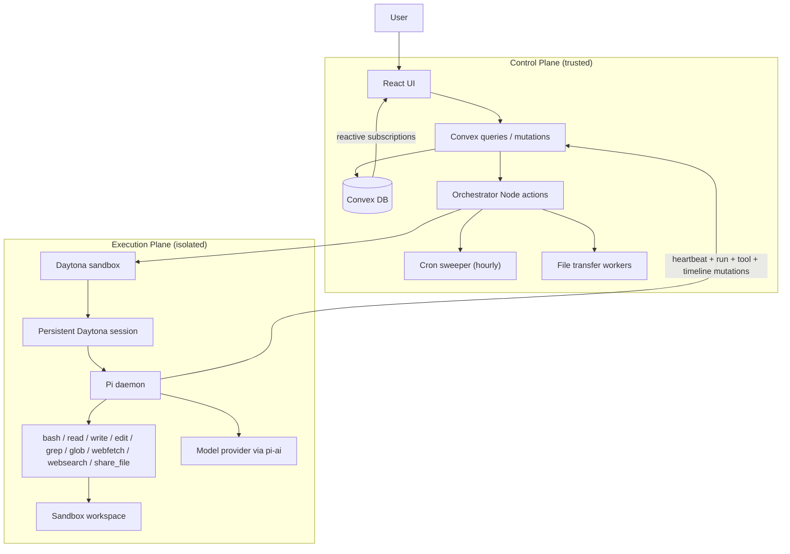
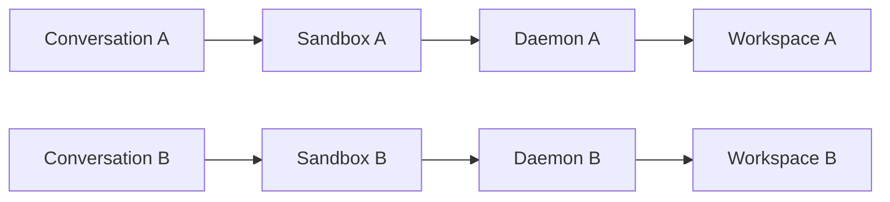
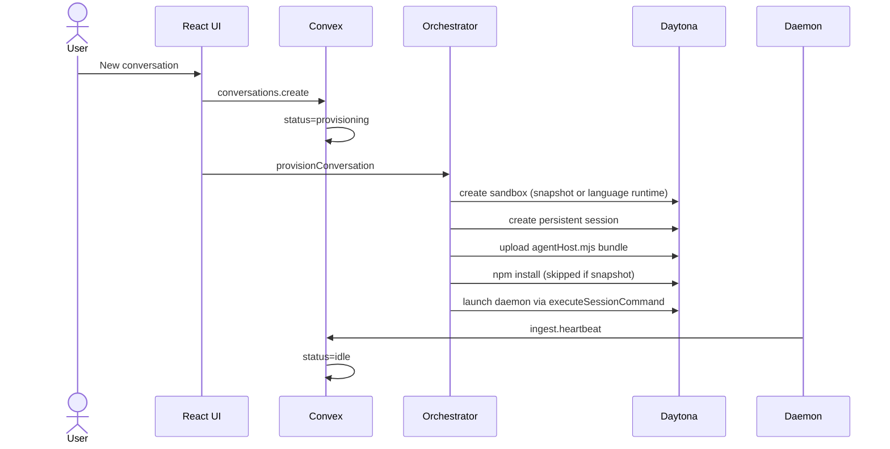
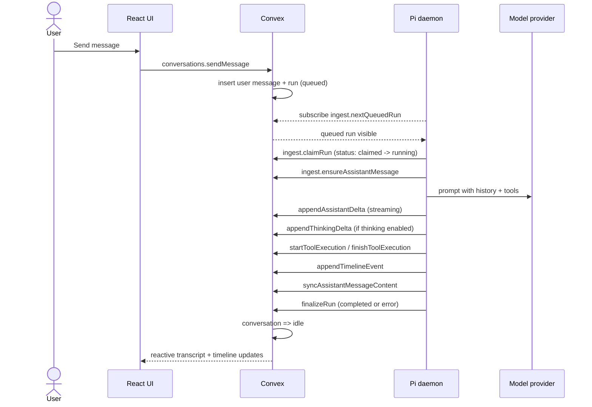
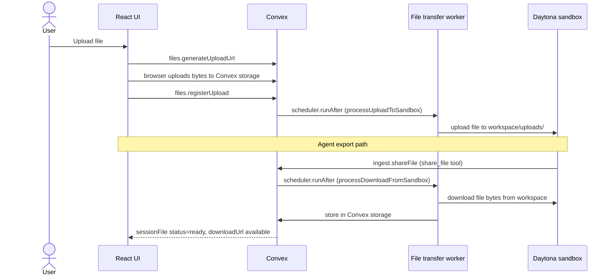
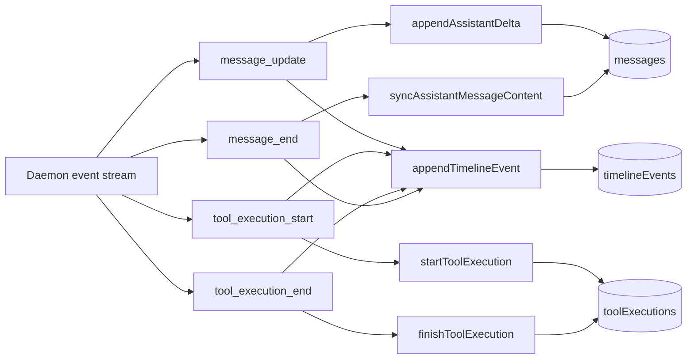
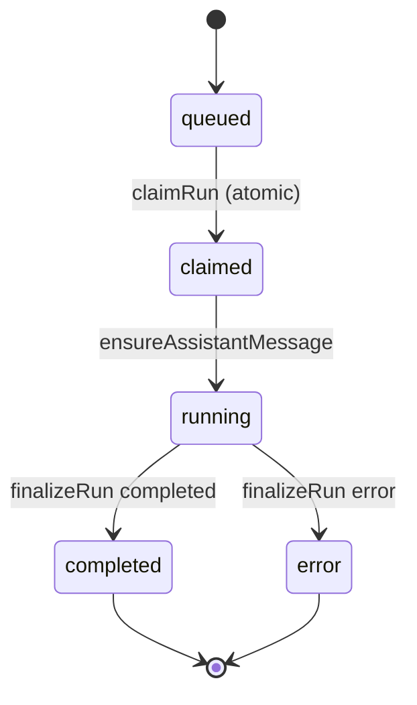
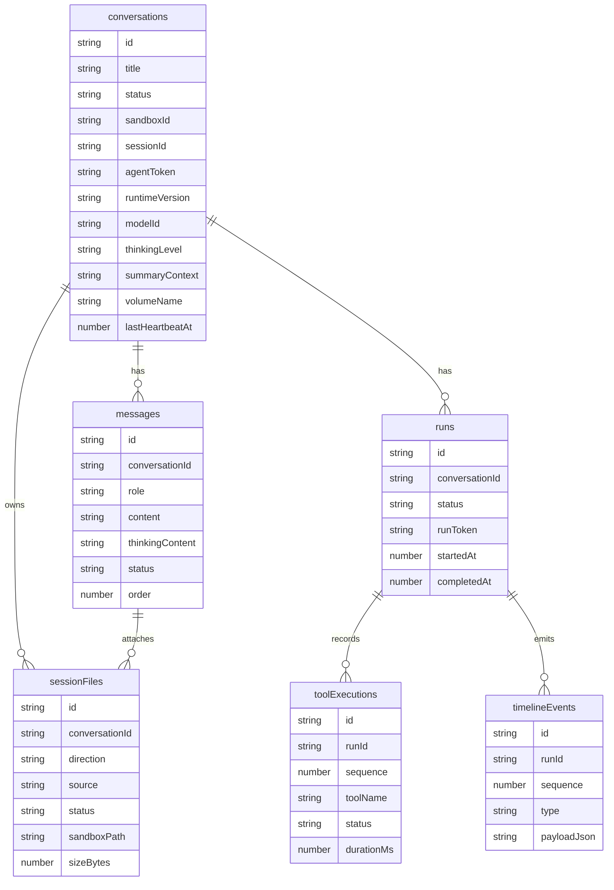

# Smart Pi Assistant

Minimal systems-design implementation of an agentic chatbot using TypeScript, Convex, Daytona, and Pi Agent.

The project is intentionally designed for the assignment goal: architecture clarity and execution-plane isolation over feature breadth.

## Demo

- YouTube: https://youtu.be/4lPLKUCL4Qw

## Assignment Fit (At a Glance)

- One conversation/thread maps to one dedicated Daytona sandbox/session.
- Pi Agent runs inside Daytona (not inside UI/backend process).
- Clear control plane vs execution plane separation.
- Progressive streaming for assistant text and thinking deltas.
- Full observability: message history, tool history, ordered timeline, raw events.

## Requirement Mapping

| Assignment requirement | Status | Where implemented |
| --- | --- | --- |
| Basic chat UI (new thread, send/receive) | Implemented | `src/components/conversation/*`, `src/components/chat/*`, `src/App.tsx` |
| Progressive streaming responses | Implemented | `agent/src/runLoop.ts`, `convex/ingest.ts`, `src/components/chat/MessageBubble.tsx` |
| New conversation creates dedicated Daytona session | Implemented | `convex/orchestrator.ts`, `convex/conversations.ts` |
| Pi Agent runs inside Daytona (not control plane) | Implemented | `agent/src/agentHost.ts`, `scripts/bundle-runtime.mjs`, `convex/orchestrator.ts` |
| Control plane vs execution plane separation | Implemented | Control: `src/*` + `convex/*`; Execution: `agent/src/*` |
| Required tools: `bash`, `read`, `write`, `edit`, `grep`, `glob`, `webfetch`, `websearch` | Implemented | `agent/src/tools/*.ts`, registered in `agent/src/tools/index.ts` |
| Structured tool outputs + streaming where feasible | Implemented | `agent/src/tools/*` output schema + `toolExecutions` + live bash chunks |
| Convex backend for state, API, and session mapping | Implemented | `convex/schema.ts`, `convex/conversations.ts`, `convex/ingest.ts`, `convex/orchestrator.ts` |
| Observability (messages + tool order/history) | Implemented | `messages`, `toolExecutions`, `timelineEvents`, UI observability panel |

## Architecture

The system has three clear zones:

- **Control plane**: React UI + Convex (state, orchestration, observability storage).
- **Bridge layer**: Orchestrator actions that provision/revive/delete Daytona sandboxes.
- **Execution plane**: one in-VM long-lived Pi daemon per conversation.

### Design Goals

- Strong isolation: each conversation has its own VM, session, workspace, and daemon.
- Honest separation: backend orchestrates, VM executes.
- Reactive UX: assistant/tool events stream and render without polling.
- Mechanical observability: each meaningful run step is persisted.
- Graceful recovery: stale daemons and broken runs can be revived/finalized.

### Component Responsibilities

| Layer | Lives where | Owns | Never does |
| --- | --- | --- | --- |
| React UI | Browser | Chat UX, conversation switching, observability rendering | Executes shell/tools directly |
| Convex queries/mutations | Control plane | Durable transcript, run queue, tool logs, timeline | Runs model-generated shell commands |
| Convex Node actions | Control plane | Sandbox lifecycle, daemon bootstrap/revival/teardown | Hosts agent execution loop |
| Daytona sandbox | Execution plane | Isolated compute, filesystem, process runtime | Source-of-truth conversation storage |
| Pi daemon | Execution plane | Run pickup, model prompts, tool calls, event emission | Provisions infrastructure |

### System Shape



### Thread-to-VM Mapping

Core invariant: one thread, one sandbox, one daemon.



Benefits:

- No cross-thread filesystem mixing.
- No shared shell process across conversations.
- Clear ownership of tool history and VM state.

## Lifecycle Choreography

### Provision Flow



### Run Flow



### File Transfer Flow



## Agent Tools

Required tools are all implemented:

- `bash`
- `read`
- `write`
- `edit`
- `grep`
- `glob`
- `webfetch`
- `websearch`

Additional helper:

- `share_file` — exports a sandbox workspace file into Convex storage as a downloadable artifact.

Tool behavior:

- Structured outputs persisted in `toolExecutions`.
- Tool execution order persisted by `sequence` and `timelineEvents`.
- Bash chunks stream incrementally via `appendToolOutput`.
- Default timeout is 5 seconds per tool call (override with `timeoutSeconds`).
- `websearch` uses Tavily if `TAVILY_API_KEY` is set; falls back to DuckDuckGo otherwise.

## Observability Design

Two-layer observability model:

- `timelineEvents`: ordered raw runtime stream.
- `toolExecutions`: normalized tool audit rows for cards/tables.



Primary observability UI:

- `src/components/observability/TimelineView.tsx`
- `src/components/observability/ToolHistoryTable.tsx`
- `src/components/observability/RawEventsDrawer.tsx`
- `src/components/chat/MessageBubble.tsx`

## Run State Model



> **Note:** The `claimed` state (absent in Prev_Readme.md) was added to make run atomicity explicit — the daemon transitions `queued → claimed` in a single mutation before any work begins, preventing double-pickup across concurrently revived daemons.

## Data Model

Core Convex tables (`convex/schema.ts`):

- `conversations` — thread metadata, sandbox/session mapping, agentToken, heartbeat, runtime version, modelId, thinkingLevel, summaryContext, volumeName, status.
- `messages` — ordered transcript with streaming assistant content, optional thinkingContent, sessionFileIds for attachments.
- `runs` — execution unit per user turn; states: queued / claimed / running / completed / error.
- `toolExecutions` — per-tool audit rows (inputJson, outputText, errorText, timing, sequence, status).
- `timelineEvents` — ordered event stream for observability and phase rendering.
- `sessionFiles` — upload/download lifecycle ledger (direction, source, status, sandboxPath, storageId, sizeBytes, downloadedAt).



## Reliability, Consistency, Security

### Reliability

- Daemon heartbeat is tracked every ~10 s; `reviveDaemonIfDead` re-launches if stale (>30 s).
- Hourly cron sweeper (`sweeper.sweepOrphans`) catches abandoned sandboxes and stale conversations.
- `reviveDaemonIfDead` also handles runtime version mismatch — re-launches daemon with the latest bundle.
- Cancel/finalize paths close in-flight `toolExecution` rows defensively.
- New user message supersedes prior in-flight runs for responsiveness.
- Snapshot-based fast path reduces cold-start from ~30 s to ~5 s when `DAYTONA_SNAPSHOT` is set.

### Consistency

- Runs are claimed atomically (`queued → claimed`) before any execution starts.
- Assistant message is ensured before delta streaming begins.
- Final assistant content is synced before run completion.
- Conversation returns to `idle` after run finalization so errors do not permanently jam the thread.

### Security and Isolation

- Untrusted tool execution stays inside Daytona sandbox.
- VM writes are token-gated (`agentToken` per conversation, `runToken` per run).
- Workspace path guards keep file operations within `/home/daytona/workspace`.
- One sandbox per conversation forms the hard isolation boundary.
- Control plane never executes model-generated code directly.

## Repository Layout

```text
AgenticAI-Assignment/
  agent/
    src/
      agentHost.ts          # daemon entry point, Convex subscription loop
      runLoop.ts            # agent turn: prompt, tools, delta emission
      agentSession.ts       # pi-agent session wrapper
      convexBridge.ts       # low-level Convex HTTP helpers
      convexApi.ts          # typed Convex mutation helpers
      deltaBuffer.ts        # streaming delta accumulator
      workspace.ts          # workspace path guards
      systemPrompt.ts       # system prompt builder
      tools/
        bash.ts
        read.ts / write.ts / edit.ts
        grep.ts / glob.ts
        webfetch.ts / websearch.ts
        shareFile.ts
        index.ts            # tool registry
  convex/
    schema.ts               # all table definitions + indexes
    conversations.ts        # thread CRUD, sendMessage, lifecycle
    ingest.ts               # VM-originated mutations (heartbeat, runs, tools, timeline)
    orchestrator.ts         # Node actions: provision / revive / delete sandbox
    files.ts                # upload URL, registerUpload, listForConversation
    fileTransfers.ts        # Node actions: processUploadToSandbox / processDownloadFromSandbox
    sweeper.ts              # orphan sandbox cleanup logic
    sweeperData.ts          # sweeper Convex queries
    crons.ts                # hourly cron registration
    daytonaUtils.ts         # safe sandbox delete helper
    lib.ts                  # shared utilities
    runtime/
      agentHostBundle.generated.ts  # bundled daemon (output of bundle:agent)
  scripts/
    bundle-runtime.mjs      # esbuild bundle script for agent
  src/
    App.tsx
    components/
      chat/
      conversation/
      layout/
      observability/
    hooks/
    lib/
    styles/
```

## Setup

### Prerequisites

- Node.js 20+
- Convex account
- Daytona API key
- OpenAI API key
- Tavily API key (recommended for better websearch)

### Install

```bash
npm install
```

### Configure Convex

```bash
npx convex dev
```

### Set Convex deployment secrets

```bash
npx convex env set DAYTONA_API_KEY "dtn_..."
npx convex env set OPENAI_API_KEY "sk-..."
npx convex env set TAVILY_API_KEY "tvly-..."        # optional but recommended
npx convex env set DAYTONA_SNAPSHOT "agentic-runtime"  # optional, faster cold start
```

### Build and typecheck

```bash
npm run bundle:agent
npm run check
```

### Start development

```bash
npm run dev
```

Open: `http://localhost:5173`

## Environment Variables

### Local client and dev CLI

- `CONVEX_DEPLOYMENT`
- `VITE_CONVEX_URL`
- `VITE_CONVEX_SITE_URL` (optional)

### Convex deployment secrets

- `DAYTONA_API_KEY`
- `OPENAI_API_KEY`
- `TAVILY_API_KEY` (optional)
- `DAYTONA_SNAPSHOT` (optional, enables snapshot fast-path)
- `AGENT_MODEL_ID` (optional, default: `gpt-4.1`)

### Runtime env injected into sandbox daemon

- `CONVEX_URL`
- `CONVEX_CONVERSATION_ID`
- `CONVEX_AGENT_TOKEN`
- `OPENAI_API_KEY`
- `TAVILY_API_KEY`
- `AGENT_WORKSPACE_DIR`
- `AGENT_MODEL_ID`
- `AGENT_THINKING_LEVEL`

## File Transfer Lifecycle

1. **User upload**
   - Browser calls `files.generateUploadUrl` → uploads bytes to Convex storage directly.
   - `files.registerUpload` creates a `sessionFiles` row (`status=queued`).
   - `fileTransfers.processUploadToSandbox` (Node action) copies file into sandbox at `workspace/uploads/`.

2. **Agent export**
   - Agent calls `share_file` tool with a workspace path.
   - `ingest.shareFile` mutation creates a `sessionFiles` row and schedules `fileTransfers.processDownloadFromSandbox`.
   - Worker reads bytes from sandbox, stores in Convex, marks `status=ready`.
   - UI shows downloadable artifact card.

3. **Session history**
   - All transfers tracked in `sessionFiles` with status transitions and metadata.
   - `files.listForConversation` resolves signed download URLs on read.

Transfer size policy: 25 MB max for both upload and export.

## Design Tradeoffs

1. **One sandbox per conversation**
   - Pro: strongest isolation and simplest ownership model.
   - Con: higher infra cost than pooled executors.

2. **Long-lived daemon per conversation**
   - Pro: better latency, smoother streaming, true "agent lives in VM" semantics.
   - Con: requires heartbeat/revive lifecycle management.

3. **Dual observability tables** (`timelineEvents` + `toolExecutions`)
   - Pro: both forensic timeline and UI-friendly tool history.
   - Con: more backend plumbing than a single log stream.

4. **Bundled runtime delivered via Convex**
   - Pro: deterministic runtime versioning, version mismatch triggers auto-revive.
   - Con: requires bundle refresh after runtime code changes.

5. **Snapshot fast-path**
   - Pro: cuts sandbox cold-start from ~30 s to ~5 s when `DAYTONA_SNAPSHOT` is set.
   - Con: snapshot image must be maintained separately; fallback to language runtime on miss.

6. **OpenAI-first**
   - Pro: single required key simplifies setup.
   - Con: model key/config drift can cause launch failures if env is incomplete.

## Useful Commands

```bash
npm run dev
npm run bundle:agent
npm run check
npx convex dev --once
npx convex dev
```